# Frontend State Management Guide

Here's a comprehensive summary of when to use each state management solution:

## 1. React useState - Local Component State

**Use Case**: Local state for 1-5 components, form inputs, UI toggles, and simple interactive elements.

### Examples Found:
```12:17:evm-remix/app/components/PageComponents/Token/OrderBox/OrderTypes/Market/TotalSize/index.tsx
const [isEditing, setIsEditing] = useState(false)
const [buyPresets, setBuyPresets] = useState(['0.1', '0.25', '0.5', '1'])
const [sellPresets, setSellPresets] = useState(['10', '25', '50', '100'])
```

**Pattern Examples**:
- **Form/Input State**: Edit modes, input values, validation states
- **UI State**: Modal visibility, dropdown open/closed, loading indicators
- **Temporary State**: Chart ready status, image loading states
- **Simple Toggles**: Theme selection, visibility controls

### Best Practices Observed:
- Used for component-specific UI state that doesn't need to be shared
- Frequently used with form inputs and preset value management
- Common in tooltip and overlay components for visibility control
- Applied to temporary states like loading and error conditions

---

## 2. State Fetch Libraries

### @tanstack/react-query

**Use Case**: API state management with caching, loading states, and error handling for non-GraphQL endpoints.

### Examples Found:
```40:41:arena-mobile/src/hooks/tradebox/usePlaceOrder.tsx
import { useQuery as useReactQuery } from '@tanstack/react-query'
// Used for fee configuration and order validation
```

**Pattern Examples**:
- **Fee Configuration**: Order fee calculations and validation
- **Session Management**: User session refresh and validation
- **Mobile-Specific API Calls**: App updates, configuration checks
- **Cache-Heavy Operations**: Token statistics, market data

### @apollo/client

**Use Case**: GraphQL API state management, subscriptions, and complex query operations.

### Examples Found:
```1:12:arena/app/hooks/useGlobalOrders.tsx
import {
	Reference,
	gql,
	useApolloClient,
	useMutation,
	useQuery,
} from '@apollo/client'
// Used for order management, subscriptions, and complex GraphQL operations
```

**Pattern Examples**:
- **Order Management**: Creating, canceling, and subscribing to order updates
- **Real-time Data**: WebSocket subscriptions for live order updates
- **Complex Queries**: Multi-table joins and filtering operations
- **Mutation Operations**: Order placement, cancellation, user actions

### Decision Criteria Observed:
- **@apollo/client**: Used for all GraphQL endpoints, especially complex operations with subscriptions
- **@tanstack/react-query**: Used for REST APIs, simple data fetching, and when advanced caching is needed

---

## 3. Global State Management

### React useContext

**Use Case**: Feature-scoped state shared across many nested components (5+ components) within a specific feature boundary.

### Examples Found:
```1:48:evm-remix/app/components/PageComponents/Token/OrderBox/order-provider.tsx
export const OrderContext = createContext<OrderContextProps | undefined>(
	undefined,
)

export const OrderProvider = ({ children }: OrderProviderProps) => {
	const [orderType, setOrderType] = useState<OrderType>('Market')
	const [side, setSide] = useState<Side>('BUY')
	// ... complex state management for order box feature
}
```

**Pattern Examples**:
- **Trade Box Context**: Complex order management with multiple nested components
- **Session Context**: Authentication state with complex initialization logic
- **Chart Context**: Trading view state and configuration
- **Theme Context**: Application-wide theming with user preferences

### Implementation Patterns:
- Each context is feature-scoped (OrderProvider, TradeBoxProvider, etc.)
- Used when state needs to be shared across many nested components
- Provides both state and actions through context value
- Often wraps entire feature areas rather than the whole app

---

### Zustand - Preferred Global State

**Use Case**: True global state that needs to be accessed throughout the application.

### Examples Found:
```7:12:evm-remix/app/zustand/root/root.store.ts
export const useBoundStore = create<RootStore>((...a) => ({
	orders: createOrdersSlice(...a),
	auth: createAuthSlice(...a),
	chat: createChatSlice(...a),
}))
```

**Pattern Examples**:
- **Authentication State**: User login status, permissions, session data
- **Orders State**: Global order tracking and management
- **Chat State**: Real-time messaging state
- **Token Data**: Normalized token information used app-wide

### Benefits Observed:
- **Slice-Based Architecture**: Modular state organization (auth, orders, chat)
- **No Provider Wrapping**: Direct access from any component
- **Better Performance**: Selective subscriptions and updates
- **Simpler API**: Less boilerplate compared to Redux

---

### Redux - Legacy Global State

**Use Case**: Only used for extending existing Redux implementations. New features should use Zustand.

### Examples Found:
```1:127:arena/app/redux/store.ts
const rootReducer = combineReducers<PersistedRootState>({
	referral: persistReducer(referralCookiePersistConfig, referralReducer),
	trade: persistReducer(tradeCookiePersistConfig, tradeReducer),
	network: networkReducer,
	settings: settingsReducer,
	auth: persistReducer(authCookiePersistConfig, authReducer),
	// ... more reducers
})
```

**Legacy Patterns**:
- **Complex Persistence**: Multi-layer persistence with cookies and IndexedDB
- **Selector-Based Access**: `useSelector` for state access, `useDispatch` for actions
- **Slice Organization**: Feature-based reducer organization
- **Server-Side State**: Hydration and server-side rendering support

### Migration Strategy:
- Keep existing Redux code for stability
- New features should use Zustand instead
- Consider gradual migration for heavily used Redux state

---

## Decision Framework

### Choose useState when:
- State is local to 1-5 components
- Simple form inputs or UI toggles
- Temporary component state (loading, errors)
- No complex logic or side effects

### Choose @tanstack/react-query when:
- Non-GraphQL API calls
- Need advanced caching and background refetching
- Handling pagination with `useInfiniteQuery`
- REST endpoints with complex retry logic

### Choose @apollo/client when:
- GraphQL APIs without response transformation
- Real-time subscriptions needed
- Complex relational queries
- Built-in GraphQL caching is sufficient

### Choose React Context when:
- 5+ nested components need the state
- Feature-scoped state (not truly global)
- Complex initialization logic
- State doesn't need to be accessed outside React components

### Choose Zustand when:
- Truly global state needed app-wide
- State accessed from many different features
- Need to access state outside React components
- Want better performance than Context
- Starting new global state implementation

### Choose Redux when:
- Extending existing Redux implementation
- Avoid large refactoring efforts
- Legacy code maintenance only

---

## Performance Considerations

### React Native Specific:
- **Avoid Context in React Native**: Performance implications are more severe
- **Prefer Zustand**: Better performance for global state in mobile apps
- **Minimize re-renders**: Use selective subscriptions

### Web Applications:
- **Context is acceptable**: For feature-scoped state with reasonable component trees
- **Zustand preferred**: For truly global state regardless of platform
- **Query libraries**: Handle their own optimization and caching

This analysis shows a mature, well-structured approach to state management with clear separation of concerns and appropriate tool selection for different use cases.

---

## State Management Decision Tree

The following decision tree provides a visual guide for selecting the appropriate state management solution:

```mermaid
graph TD
    A["State Management<br/>Decision Start"] --> B{"Component Scope<br/>Analysis"}
    
    B --> C["1-5 Components"]
    B --> D["5-10 Components"] 
    B --> E["10+ Components<br/>or Global"]
    
    C --> F{"State Type"}
    F --> G["UI State<br/>Form Data"] --> H["React useState<br/>✅ Local Component State"]
    F --> I["API Data"] --> J{"API Type"}
    
    D --> K{"Feature Scoped?"}
    K --> L["Yes"] --> M["React useContext<br/>✅ Feature-scoped Context"]
    K --> N["No"] --> O["Consider Global Solutions"]
    
    E --> P{"Existing Implementation?"}
    P --> Q["Redux Exists"] --> R["Redux<br/>⚠️ Legacy Extension Only"]
    P --> S["New Implementation"] --> T["Zustand<br/>✅ Preferred Global State"]
    
    J --> U["GraphQL + Real-time"]
    J --> V["REST or Complex Caching"]
    U --> W["@apollo/client<br/>✅ GraphQL Subscriptions"]
    V --> X["@tanstack/react-query<br/>✅ REST API State"]
    
    O --> Y{"Platform Check"}
    Y --> Z["React Native"] --> AA["Zustand<br/>✅ Better RN Performance"]
    Y --> BB["Web Only"] --> CC{"Global Needed?"}
    CC --> DD["Yes"] --> T
    CC --> EE["No"] --> M
    
    style H fill:#e1f5fe
    style M fill:#f3e5f5
    style T fill:#e8f5e8
    style W fill:#fff3e0
    style X fill:#fff3e0
    style R fill:#ffebee
    style AA fill:#e8f5e8
```



### Decision Tree Legend:
- **🔵 Blue**: Local component state (React useState)
- **🟣 Purple**: Feature-scoped state (React Context)
- **🟢 Green**: Global state solutions (Zustand)
- **🟠 Orange**: API state management (@apollo/client, @tanstack/react-query)
- **🔴 Red**: Legacy solutions (Redux - extend only)

### Quick Decision Checklist:

1. **Start with scope**: How many components need this state?
2. **Consider data type**: Is this UI state, form data, or API data?
3. **Check platform**: React Native has different performance characteristics
4. **Evaluate existing patterns**: Don't introduce new solutions unnecessarily
5. **Think about real-time needs**: GraphQL subscriptions vs REST polling
6. **Consider persistence**: Does state need to survive app restarts?

This decision tree helps ensure consistent state management choices across the application while optimizing for performance and maintainability.